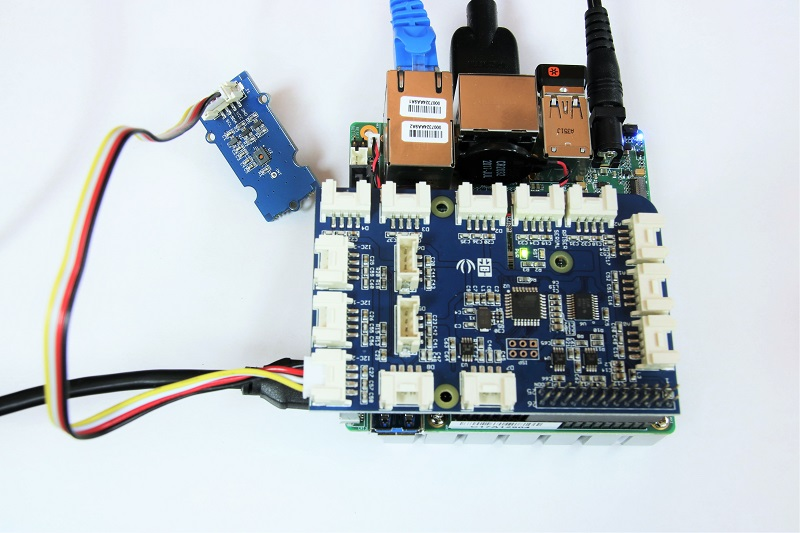
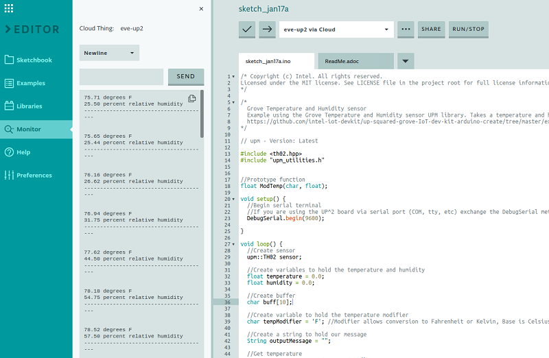

# Grove\* Temperature and Humidity Sensor
This tutorial demonstrates how to use the Grove Temperature and Humidity sensor with the UP Squared* board and the UPM library.

## What you'll learn
* How to find the right UPM sensor library for your device
* Instantiate a UPM sensor library class
* How to use the [Delay](https://www.arduino.cc/reference/en/language/functions/time/delay/) function in Arduino\*
* How to use the [DebugSerial](https://www.arduino.cc/reference/en/language/functions/communication/serial/) function in Arduino

## Gather your materials
* [UP Squared* board](http://www.up-board.org/upsquared)
* [GrovePi+\*](http://wiki.seeedstudio.com/wiki/GrovePi%2b)
* [Grove\* Temperature and Humidity Sensor](https://upm.mraa.io/sensorDetail.html?name=th02)

## Setup
Plug the Grove Temperature and Humidity sensor into any available I2C port on the GrovePi+.  



## How it works
In order for any UPM library to work, you need to include the header file corresponding to that particular sensor in your sketch. Unfortunately, if you browse the Libraries in Arduino Create\* and include the UPM library, all the UPM sensor libraries will be included, and you probably only need one or two out of the several hundred.

The solution is to find your sensor first in the list https://iotdk.intel.com/docs/master/upm/modules.html 

Then copy the name of the .hpp file.

**Note: UPM libraries are generally defined by part number**

At the top of your sketch include it, for example:
```
#include <th02.hpp>
```
To instantiate:
```
upm::TH02 sensor = upm::TH02();
```

For a full list of examples see https://github.com/intel-iot-devkit/upm/tree/master/examples/c%2B%2B



IMPORTANT NOTICE: This software is sample software. It is not designed or intended for use in any medical, life-saving or life-sustaining systems, transportation systems, nuclear systems, or for any other mission-critical application in which the failure of the system could lead to critical injury or death. The software may not be fully tested and may contain bugs or errors; it may not be intended or suitable for commercial release. No regulatory approvals for the software have been obtained, and therefore software may not be certified for use in certain countries or environments.
