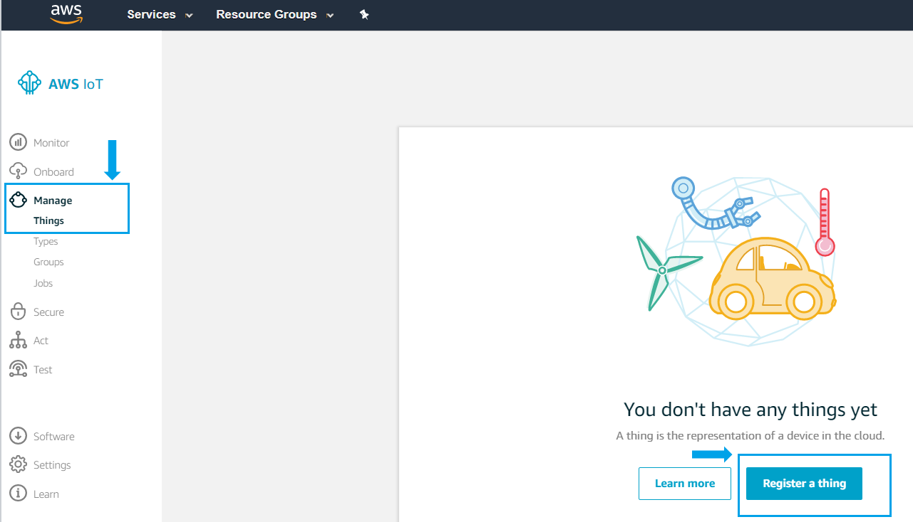
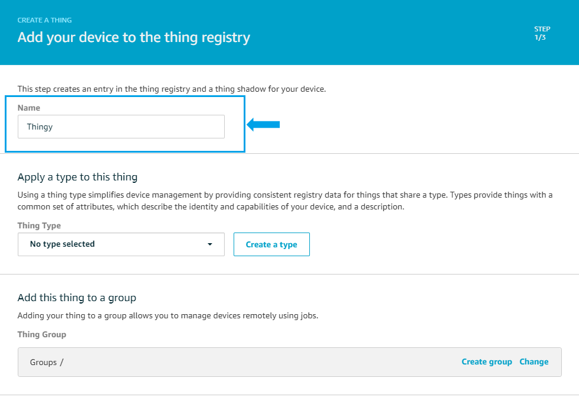

# MQTT Publication with Amazon Web Services (AWS)\*
<table>
	<tr>
		<td>Programming language</td>
		<td>C++ (Arduino)</td>
	</tr>
	<tr>
		<td>Skill level</td>
		<td>Intermediate</td>
	</tr>
	<tr>
		<td>Time to complete</td>
		<td>15 minutes</td>
	</tr>
	<tr>
		<td>Hardware needed</td>
		<td>UP Squared* Grove* IoT Development Kit</td>
	</tr>
	<tr>
		<td>Target Operating System</td>
		<td>Ubuntu 16.04</td>
	</tr>
</table>

This tutorial demonstrates how to use an UP Squared\* board together with the Arduino Create\* IDE to publish messages (sensor data) via MQTT, a messaging protocol suited for IoT applications, to the Amazon Web Services (AWS)\* cloud platform.

**Note**: we use the [aws-iot-device-sdk-cpp.h](https://github.com/intel-iot-devkit/aws-iot-device-sdk-cpp-arduino-create) library, which is a modified version of the [AWS\* IoT Device SDK](https://github.com/aws/aws-iot-device-sdk-cpp).  

## What you'll learn
From this code sample tutorial you'll learn how to:
* Setup an AWS account and a Thing (a representation of a cloud device)
* Create a certificate for your Thing and enter that certificate in a “Secret” tab (located in the Arduino Create IDE)
* View MQTT Messages (sensor data) with the AWS IoT MQTT Client

## Gather your materials
### Hardware
* [UP Squared board](http://www.up-board.org/upsquared/) 
* GrovePi+\*
* Grove\* rotary angle sensor
### Software
* [Arduino Create](https://create.arduino.cc/)
#### Software dependencies
* libcrypto
* libssl  

**Note**: if you are using the OS that was shipped with the UP Squared Grove IoT Development Kit, these software dependencies will already be installed. Otherwise you need to install them via apt-get.

## Prerequisites
* [Set up your UP Squared](https://software.intel.com/en-us/upsquared-grove-getting-started-guide)
* [Connect your UP Squared to Arduino Create](https://software.intel.com/en-us/upsquared-grove-getting-started-guide-create-account)

## Before you begin
Complete the sensor setup below. Assuming you've already completed the prerequisites, connect the GrovePi+ to the UP Squared board and then connect the rotary angle sensor to A0 (analog pin 0).

## Tutorial steps
Follow along with the steps below to send data from a rotatry angle sensor (via MQTT) to the AWS cloud platform for viewing.

1. [Set up an AWS account](readme.md#step-1-set-up-an-AWS-account)

2. [Create a Thing](readme.md#step-2-create-a-thing)

3. [Create and attach a policy to your Thing](readme.md#step-3-create-and-attach-a-policy-to-your-thing)

4. [Get the HTTPS endpoint value](readme.md#step-4-get-the-https-endpoint-value)

5. [Get the code](readme.md#step-5-get-the-code)

6. [View data sent via MQTT in the AWS console](readme.md#step-6-monitor-the-topic-in-AWS-IoT-dashboard)

## Step 1: Set up an AWS account

a.  Go to the [AWS IoT console](https://aws.amazon.com/console/) and register or sign in.

b.  In the AWS services search bar, type and select "AWS IoT".

    
c.  Click "Get started"
    

    
## Step 2: Create a Thing
### Register a Thing
A *Thing* is a representation of your device in the cloud.

a.  From  the left navigation panel, choose Manage &gt; Things &gt; and then click on "Register a
    thing"
    

 
b.  To register an AWS IoT Thing, select "Create a singe thing" 

c.  Enter a name for your Thing (for example, "Thingy") and then click "Next" (bottom right hand corner of the screen)

### Add a certificate to your Thing    
a.  Choose "Create certificate" to generate a certificate, public key and private key.
    

b. Download all four certificate files and then click ‘Activate’. 

    
## Step 3: Create and attach a policy to your Thing
### Create a policy
a. From the navigation pane, choose Secure &gt; Policies &gt; and then click on "Create a policy"

b. Give your policy a name (for example, "my-iot-policy". To "Add statements" choose "iot:\*" for **Action**, "\*" for **Resource ARN** and then select "Allow" for **Effect**. Now click "Create".

### Attach a policy to your Thing

a. On the main AWS IoT console page, navigate to Manage &gt; Things &gt; and select the Thing you created earlier.

b. Select the "Security" tab and click on the certificate you've attached to your Thing.

c. From the **Actions** dropdown, select "Attach policy".

d. Select the policy you created earlier and then click "Attach"

## Step 4: Get the HTTPS endpoint value

7.  In your Thing, select the "Interact" tab and copy the HTTPS endpoint value. This value
    will be used in the sample.

    

## Step 5: Get the code

a.  Open the PubSub example in Arduino Create\* **Examples>FROM LIBRARYES>UP SQUARED GROVE IOT DEV KIT>MqttPubAWS**

    

b.  Enter the endpoint value, the thing name and the client ID in the
    sample file’s \#define. The client ID and thing name are same.
    Update the sample pub-sub topic if you want.

    

c.  Switch to the SECRET tab. Open the files downloaded as text file and
    copy the string to the entries in the secret tab.

    SECRET\_ROOT\_CA : Content of file “VeriSign-Class
    3-Public-Primary-Certification-Authority-G5.pem”

    SECRET\_CLIENT\_CERT : Content of file ending in
    \*-certificate.pem.crt

    SECRET\_CLIENT\_PRIVATE\_KEY : Content of file ending in
    \*-private.pem.key.
    
    Click ‘Save’ and Verify and upload the sample to device.

    Note : To be more secure, it is recommended that the root
    certificate, cient certificate and client private key be put on the
    device directly and read from there by the sample. To do that,
    transfer these files to your device, make note of the absolute file
    name and provide that in the values in the secret path. In the
    DEFAULTSAMPLECONFIG value, set ‘load\_crts\_as\_string’ to false.
    This will load the certificates from those file paths instead of as
    strings.

## Step 6: Monitor the topic in AWS IoT dashboard

a.  Go to the Dashboard (you can navigate to it in the left menu from the console https://aws.amazon.com/console/). A graphical representation of device connections and messages can be seen.  You should see a connection corresponding to the time you ran the sketch.
    

b.  The sample’s published messages can be tested by received by
    subscribing to the topic through the Test widget.  Navigate to the Test widget from the console https://aws.amazon.com/console/.

    Enter the name of the thing that was created
    earlier e.g. ‘thing-01’. Client ID and thing name are same. Click
    ‘Connect’.
    
    
    Enter the topic that the sample is configured to. This is the value
    of SDK\_SAMPLE\_TOPIC in the program, which is 'sdk/test/cpp' in this case. Click ‘Subscribe to Topic’
    
    
    When the sample runs, you will see the published messages, like below:

    

